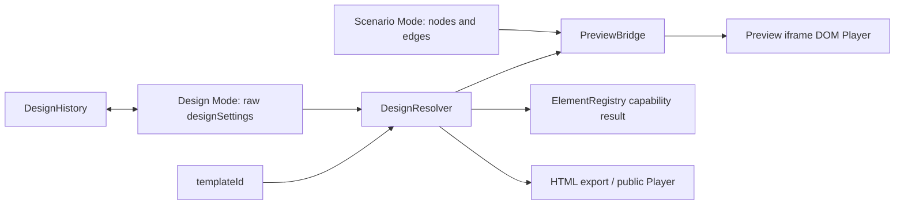

# Design Studio Architecture

This document describes the target architecture for the next design-system stages. It is intentionally a design contract, not an implementation completed in stage 1.

## Principles

- The main Player remains a DOM application.
- Do not replace the Player with a bitmap canvas.
- Preserve accessibility, adaptive layout, HTML forms, Telegram/MAX embedding paths, public links and HTML export.
- Keep old quizzes working through migrations and resolver defaults.
- Make every design control traceable to a supported Player element or mark it template-limited.
- Keep screen quiz as a professional show template without adding logic nodes, scoring, variables or achievements to that mode.

## Modes

### Scenario Mode

Purpose: edit graph logic, nodes, edges and data flow.

Owns:

- nodes and edges;
- selected node settings;
- logic paths;
- global timer;
- save/load/autosave;
- existing canvas undo/redo.

Does not own:

- global visual tokens;
- template capability decisions;
- design history.

### Design Mode

Purpose: edit the visual system of the quiz.

Owns:

- `designSettings`;
- template-specific design settings;
- preset application;
- resolved design preview;
- design undo/redo;
- template capability warnings;
- responsive overrides.

Design Mode should not mutate graph topology.

### Preview Mode

Purpose: run a realistic Player preview without publishing.

Owns:

- iframe lifecycle;
- `PreviewBridge` messages;
- start node selection;
- preview-only generation options;
- state preservation where possible.

Preview Mode should prefer patching design variables over iframe remounts when only design tokens change.

### Publish Mode

Purpose: validate and export/publish the final quiz.

Owns:

- public/private/unlisted visibility;
- HTML export;
- public link validation;
- template compatibility warnings;
- export readiness checks;
- SEO/metadata when the route is public and indexable.

## Core Components

### DesignResolver

Inputs:

- raw `designSettings`;
- `templateId`;
- quiz schema version;
- optional node-level overrides;
- device breakpoint.

Outputs:

- normalized design object with no accidental `undefined`;
- template capability result;
- warnings for ignored or unsupported settings;
- migration metadata.

Responsibilities:

- merge defaults with legacy data;
- preserve old quizzes;
- use nullish semantics instead of broad `||`;
- sanitize and clamp numeric values;
- validate enum values;
- resolve preset conflicts;
- produce stable values for UI, Player and export.

### DesignHistory

Purpose: undo/redo for design changes without coupling to graph history.

Responsibilities:

- snapshot resolved or raw design patches;
- group slider drags into one history entry;
- support template changes and preset application as atomic actions;
- avoid recording preview-only changes;
- expose command labels such as "Apply interface preset" or "Change card radius".

### PreviewBridge

Purpose: reduce iframe remounts and preserve state during design edits.

Message examples:

- `design:update`
- `design:resolved`
- `preview:navigate`
- `preview:restart`
- `preview:request-state`
- `preview:state`

Rules:

- design token changes should update CSS variables/classes in place;
- structural changes can still remount;
- template id changes remount;
- graph topology changes can remount unless a safe patch path exists.

### ElementRegistry

Purpose: describe what can be styled in each template.

Registry entry shape:

- element id;
- display name;
- supported templates;
- CSS selectors or runtime bindings;
- supported properties;
- responsive behavior;
- accessibility constraints;
- export support.

Examples:

- `quiz.background`
- `quiz.brand`
- `question.card`
- `question.media`
- `answer.card`
- `progress.bar`
- `result.panel`
- `screenQuiz.stage`
- `screenQuiz.timer`

### PropertyInspector

Purpose: render design controls from schema instead of hand-wiring every field.

Responsibilities:

- show only supported controls for current template/mode;
- mark template-limited controls;
- bind controls to normalized paths;
- support color, range, select, segmented, URL, toggles and future typography tools;
- show reset-to-default at property and section level.

### Responsive Overrides

Target shape:

```ts
designSettings: {
  base: { ... },
  breakpoints: {
    tablet?: { ... },
    mobile?: { ... }
  }
}
```

Rules:

- base remains backward-compatible with current `DesignSettings`;
- overrides are sparse patches;
- resolver produces final device-specific design;
- preview can switch viewport without mutating the base design.

### Constrained Canva Mode

Purpose: enable fixed-format composition for screen quizzes and social/video formats while keeping DOM rendering.

Constraints:

- DOM elements remain real DOM nodes;
- no bitmap-only Player;
- fixed aspect ratios such as 16:9, 9:16 and 1:1 can be used as preview/export constraints;
- layout bounds, safe areas and typography fitting are explicit;
- export can capture the DOM output, not replace authoring with a canvas renderer.

## Data Flow



## Compatibility Strategy

1. Keep the current `DesignSettings` shape readable.
2. Add resolver defaults instead of mutating legacy data on load.
3. Add migrations only when a persisted shape must change.
4. Preserve unknown keys during load/save unless they are unsafe.
5. Keep `screenQuiz` settings isolated from generic template settings.
6. Add tests before changing runtime behavior.

## Testing Strategy

Required test groups for the next implementation stages:

- resolver defaults and legacy partial data;
- `null` and `undefined` handling;
- preset application without stale leftovers;
- UI schema and registry coverage;
- default Player and generated HTML parity;
- LivePreview patch/remount behavior;
- template capability warnings;
- screen quiz global and node-level overrides;
- responsive override resolution;
- import/export round trip.

## Non-Goals

- Do not rewrite the scenario editor architecture in this track.
- Do not move all templates to one visual system in a single step.
- Do not make screen quiz a logic/scoring mode.
- Do not remove existing template ids or break old quiz JSON.
