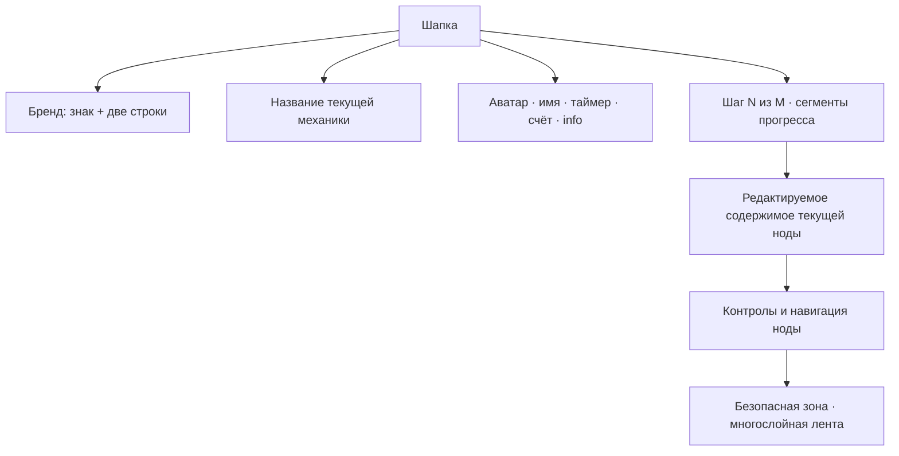

# Визуальный паспорт шаблона «Разговоры о важном»

Статус: утверждённая спецификация для этапов 2–8.
Область текущей реализации: общая оболочка, шапка, HUD, прогресс, фон и нижняя декоративная зона.

## 1. Источники и принцип реализации

Композиция основана на шести пользовательских прототипах:

- `19dd8f8b-43f5-4092-b2e3-63644e34e9e3.png` — информационный экран;
- `fb508570-1747-4bac-bbd6-88d86e9eeb66.png` — одиночный выбор;
- `e2ce6b7a-2461-4b71-9edc-6280375fb26f.png` — множественный выбор;
- `4c78d829-cc9a-4d04-a734-4bac6dc87780.png` — сопоставление;
- `b9e6b414-b09c-4105-8ab6-77b40c6dc23d.png` — хронология;
- `dad420da-30d8-481b-af7c-86ae2facf855.png` — ввод текста.

Изображения прототипов не используются как фон интерфейса. Текст, медиа, логотип, аватар, название счёта и содержимое нод остаются редактируемыми. Шаблон сохраняет общий quiz runtime и получает только отдельный presentation layer.

## 2. Диагноз предыдущей версии

Предыдущая версия была технически корректной, но визуально наследовала базовый шаблон:

- шапка состояла из двух колонок вместо трёх выраженных зон;
- бренд был уменьшен до обычного логотипа приложения;
- HUD находился в одной универсальной карточке и выглядел как dashboard;
- название механики отсутствовало как самостоятельный композиционный центр;
- прогресс был тонкой полосой, а не последовательностью этапов;
- отсутствовал отдельный индикатор «Шаг N из M»;
- триколор был фоновым псевдоэлементом без глубины и повторяемого ритма;
- ботаника и точки были случайным декором, а не частью системы;
- оболочка не помещалась целиком на компактном ноутбуке.

## 3. Арт-дирекшн

### Основное направление

- Theme paradigm: **Pristine Light Mode**.
- Background character: **tactile textured surface**.
- Typography: **Swiss rational hierarchy на базе Manrope**.
- Hero architecture: **asymmetric split composition**.
- Section system: **строгая презентационная сетка без dashboard-панелей**.

### Четыре фирменных компонента

1. Двухслойный знак из облачков диалога.
2. Центральная синяя капсула механики с группами точек.
3. Отдельная пара «шаг + сегментированный прогресс».
4. Многослойная нижняя лента с ботаническими акцентами.

### Два типа движения

1. Cinematic fade-through при смене экрана.
2. Staggered float-up для контролов внутри ноды.

Анимации не меняют размеры контейнеров и не используют layout-свойства.

## 4. Палитра

| Токен | Значение | Назначение |
|---|---:|---|
| `talks-blue-700` | `#063EB7` | основные кнопки, активные элементы |
| `talks-blue-600` | `#0B52D6` | капсула механики, иконки |
| `talks-blue-100` | `#E9F2FF` | мягкие подложки |
| `talks-red-600` | `#E5242F` | второй цвет бренда, акцент |
| `talks-ink` | `#071F58` | заголовки |
| `talks-copy` | `#17346F` | основной текст |
| `talks-muted` | `#7180A2` | подписи |
| `talks-paper` | `#FAF9F5` | фон страницы |
| `talks-surface` | `#FFFFFF` | поверхности |
| `talks-line` | `#DDE6F4` | границы и неактивный прогресс |
| `talks-gold` | `#F4B620` | искра счёта |

Красный используется дозированно: логотип, корректирующее состояние, одна иконка или нижняя лента. Основной интерактивный цвет — кобальтовый синий.

## 5. Типографика

Основной и display-шрифт: `Manrope`, fallback — `Plus Jakarta Sans`, затем системный sans-serif.

| Элемент | Desktop 1680 | Compact 1366 | Mobile |
|---|---:|---:|---:|
| Бренд, строка 1 | 34 px / 900 | 28 px / 900 | 20 px / 900 |
| Бренд, строка 2 | 31 px / 900 | 25 px / 900 | 18 px / 900 |
| Название механики | 26 px / 800 | 21 px / 800 | 15 px / 800 |
| Имя участника | 18 px / 700 | 16 px / 700 | 14 px / 700 |
| Таймер | 18 px / 800 | 16 px / 800 | 14 px / 800 |
| Название счёта | 11 px / 800 | 10 px / 800 | скрывается |
| Значение счёта | 30 px / 800 | 25 px / 800 | 18 px / 800 |
| Индикатор шага | 18 px / 600 | 16 px / 600 | 14 px / 700 |

Заголовки используют `letter-spacing: -0.035em`, подписи HUD — `0.06em`. Числа используют tabular figures.

## 6. Сетка и размеры

### Desktop 1680×945

- внешний горизонтальный gutter: 54–60 px;
- максимальная ширина оболочки: 1570 px;
- высота первого ряда шапки: 104–112 px;
- колонки: `28% / 40% / 32%`;
- второй ряд: шаг 220 px, прогресс 430–500 px, свободная область;
- расстояние до контента: 18–22 px;
- нижняя безопасная зона: 96–112 px;
- высота ленты: 88–118 px.

### Compact 1366×768

- внешний gutter: 38–44 px;
- первый ряд: 88–94 px;
- колонки: `30% / 36% / 34%`;
- второй ряд: 54–58 px;
- нижняя безопасная зона: 72–82 px;
- HUD уменьшает интервалы, но остаётся в одну строку.

### Mobile до 720 px

- бренд и компактный HUD располагаются в первой строке;
- центральная капсула занимает отдельную вторую строку;
- шаг и прогресс располагаются в третьей строке;
- имя и подписи HUD могут скрываться, аватар, таймер и счёт сохраняются;
- лента уменьшается до 64–78 px;
- горизонтальный скролл запрещён.

## 7. Иерархия оболочки



## 8. Wireframe: информационный экран 1680×945

```text
┌──────────────────────────────────────────────────────────────────────────────┐
│ [LOGO + НАЗВАНИЕ]       ·· [ ИНФОРМАЦИЯ ] ··      [AV] Анна  ◯14:32  120  ⓘ │
│                                                                              │
│ [⚑ Шаг 1 из 6]          [ ●  ○  ○  ○  ○  ○ ]                               │
│                                                                              │
│ ┌───────────────────────────────────────┐ ┌───────────────────────────────┐  │
│ │                                       │ │ ♥ вводный текст              │  │
│ │    крупный заголовок + иллюстрация    │ ├───────────────────────────────┤  │
│ │    редактируемое изображение          │ │ ЧТО ВАС ЖДЁТ                 │  │
│ │                                       │ │ ▣ 6 заданий                  │  │
│ └───────────────────────────────────────┘ │ ◈ проверка знаний            │  │
│                                           │ ◉ полезные размышления       │  │
│ [ ● ○ ○ ○ ○ ○ ]                          └───────────────────────────────┘  │
│                                                  [      НАЧАТЬ  →      ]     │
│  ≋ белая волна  ≋ синяя волна  ≋ красная волна  ≋ ботаника                  │
└──────────────────────────────────────────────────────────────────────────────┘
```

## 9. Wireframe: компактный вопрос 1366×768

```text
┌──────────────────────────────────────────────────────────────────────────────┐
│ [LOGO + НАЗВАНИЕ]      ·· [ ВОПРОС 1 ] ··      [AV] Анна  ◯14:32  120  ⓘ    │
│ [⚑ Шаг 2 из 6]          [ ●  ○  ○  ○  ○  ○ ]                               │
│ ┌──────────────────────────────────────────────────────────────────────────┐ │
│ │ Какое качество помогает...                 [редактируемая иллюстрация]  │ │
│ │ Выберите один ответ                     ≋ локальная цветовая волна     │ │
│ └──────────────────────────────────────────────────────────────────────────┘ │
│ [ ◉ Уважение                    ] [ ○ Равнодушие                         ] │
│ [ ○ Эгоизм                      ] [ ○ Безответственность                 ] │
│ [ ← Назад ]                                             [ Далее → ]          │
│ ≋══════════════════ нижняя многослойная лента ═══════════════════════════≋ │
└──────────────────────────────────────────────────────────────────────────────┘
```

## 10. Wireframe: mobile

```text
┌───────────────────────────────┐
│ [LOGO]               [AV] 120 │
│ ·· [ ВОПРОС 1 ] ··      14:32 │
│ [⚑ 2/6] [● ○ ○ ○ ○ ○]        │
│ ┌───────────────────────────┐ │
│ │ содержимое текущей ноды   │ │
│ │ иллюстрация               │ │
│ └───────────────────────────┘ │
│ [ ответ ]                    │
│ [ ответ ]                    │
│ [ ответ ]                    │
│ [ ответ ]                    │
│ ≋ нижняя лента ≋             │
└───────────────────────────────┘
```

## 11. Компонентные правила

### Бренд

- знак состоит из трёх перекрывающихся облачков;
- текст всегда двухстрочный: синяя первая строка и красная вторая;
- пользовательский `logoUrl` заменяет знак, но не скрывает название;
- пользовательский `brandName` допускается, однако для этого шаблона визуально делится на две строки.

### Название механики

- центрируется относительно viewport, а не свободного пространства между краями;
- меняется по типу текущей ноды;
- для вопроса допускается номер: «Вопрос 2»;
- точки слева и справа — часть компонента, а не отдельные символы текста.

### HUD

- не имеет общего белого контейнера;
- каждый элемент остаётся визуально самостоятельным;
- аватар — squircle 62–70 px;
- таймер — круг или почти круг с тонкой синей обводкой;
- счёт содержит подпись, крупное число и золотую искру;
- info — отдельная круглая кнопка без runtime-действия до отдельного этапа.

### Прогресс

- индикатор шага и сегменты не объединяются в одну панель;
- число сегментов визуально ограничено разумным количеством, но ARIA-текст хранит точное значение;
- заполнение обновляется существующим HUD runtime;
- процент остаётся доступным для screen reader, но не обязан быть видимым.

### Нижняя лента

- три самостоятельных слоя: белый, синий, красный;
- слои имеют разные амплитуды и фазы;
- лента фиксирована относительно viewport, но не перехватывает события;
- контент получает безопасный нижний padding;
- при `design-hide-background-decor` лента и ботаника скрываются.

## 12. Поверхности и тени

- крупные поверхности: radius 26–34 px;
- внутренние контролы: radius 18–22 px;
- HUD-окружности: 50%;
- основной shadow: `0 16px 42px rgba(25, 55, 118, .12)`;
- ближний shadow: `0 3px 10px rgba(25, 55, 118, .08)`;
- свет всегда приходит сверху слева;
- запрещены тяжёлые серые тени и glassmorphism.

## 13. Accessibility и motion

- контраст текста не ниже WCAG AA;
- интерактивные элементы имеют видимый `:focus-visible`;
- HUD имеет семантические `aria-label`;
- декоративные элементы скрыты от accessibility tree;
- `prefers-reduced-motion` отключает декоративные переходы;
- анимации используют только `opacity`, `transform`, `background`, `border-color` и `box-shadow`.

## 14. Acceptance criteria этапа 2

- оболочка визуально соответствует wireframe на 1680×945 и 1366×768;
- бренд, центральная капсула и HUD образуют три отдельные зоны;
- присутствуют шаг, сегментированный прогресс и нижняя трёхслойная лента;
- HUD не выглядит как единая dashboard-карточка;
- таймер, аватар, имя и счёт используют существующий runtime;
- центральная подпись и шаг обновляются при переходе между нодами;
- desktop и compact first view не имеют горизонтального скролла;
- mobile не имеет горизонтального переполнения;
- preview и standalone export используют одну разметку;
- поведение вопросов и навигации не изменено.
